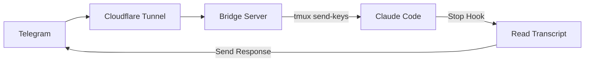

# claudecode-telegram


Telegram bot bridge for Claude Code. Send messages from Telegram, get responses back.

## How it works



1. Bridge receives Telegram webhooks, injects messages into Claude Code via tmux
2. Claude Code's Stop hook reads the transcript and sends the response back to Telegram
3. Only responds to Telegram-initiated messages (uses a pending file as a flag)

## Install

```bash
# Prerequisites
brew install tmux cloudflared jq

# Clone
git clone https://github.com/ericpeterss/claudecode-telegram
cd claudecode-telegram

# Setup Python env (optional, only needed for bridge.py)
uv venv && source .venv/bin/activate
uv pip install -e .
```

## One-time Setup

### 1. Create Telegram bot

Message [@BotFather](https://t.me/BotFather) on Telegram, run `/newbot`, and save your **bot token**.

### 2. Get your Telegram Chat ID

Start a chat with your bot, then run:
```bash
curl "https://api.telegram.org/bot<YOUR_TOKEN>/getUpdates"
```
Look for `"id"` inside the `"chat"` object — that is your Chat ID.

### 3. Add environment variables

```bash
# Add to ~/.zshrc (or ~/.bashrc)
export TELEGRAM_BOT_TOKEN="your_bot_token_here"
export TELEGRAM_ALLOWED_CHAT_ID="your_chat_id_here"   # whitelist: only you can use the bot

source ~/.zshrc
```

### 4. Install the Stop hook

The Stop hook fires after every Claude response, reads the transcript, and sends it to Telegram.

```bash
mkdir -p ~/.claude/hooks
cp hooks/send-to-telegram.sh ~/.claude/hooks/
chmod +x ~/.claude/hooks/send-to-telegram.sh
```

Add to `~/.claude/settings.json` (use the **full absolute path**, not `~`):
```json
{
  "hooks": {
    "Stop": [{
      "hooks": [{
        "type": "command",
        "command": "/Users/YOUR_USERNAME/.claude/hooks/send-to-telegram.sh"
      }]
    }]
  }
}
```

> **Important:** Replace `/Users/YOUR_USERNAME` with your actual home directory path (run `echo $HOME` to check).

## Starting the System (every time)

Follow these steps in order each time you want to use the bridge.

### Step 1 — Start tmux session with Claude Code

Open a new terminal and run:

```bash
# Load environment variables
source ~/.zshrc

# Create tmux session (skip if already running)
tmux new-session -d -s claude

# Attach to session and start Claude Code
tmux send-keys -t claude "unset CLAUDECODE && source ~/.zshrc && claude --dangerously-skip-permissions" Enter
```

> **Why `unset CLAUDECODE`?** If you run this from inside Claude Code, the `CLAUDECODE` env var will block a new Claude instance from starting. Always unset it first.

You can attach to watch the session:
```bash
tmux attach -t claude
```
Press `Ctrl+B` then `D` to detach without stopping it.

### Step 2 — Start the bridge server

In a **separate terminal** (not inside tmux):

```bash
cd /path/to/claudecode-telegram
source ~/.zshrc
python bridge.py
```

The bridge listens on port 8080 for incoming Telegram webhooks.

### Step 3 — Start Cloudflare Tunnel

In another **separate terminal**:

```bash
cloudflared tunnel --url http://localhost:8080
```

Copy the `https://....trycloudflare.com` URL from the output.

### Step 4 — Register the webhook

Tell Telegram where to forward messages (run once per tunnel URL — the URL changes each restart):

```bash
curl "https://api.telegram.org/bot${TELEGRAM_BOT_TOKEN}/setWebhook?url=https://YOUR-TUNNEL-URL.trycloudflare.com"
```

You should see `{"ok":true,...}`.

### Step 5 — Send a test message

Open Telegram, send a message to your bot (e.g. `hello`), and Claude's response should appear within a few seconds.

## Bot Commands

| Command | Description |
|---------|-------------|
| `/status` | Check tmux session status |
| `/clear` | Clear Claude conversation |
| `/resume` | Pick a past session to resume (inline keyboard) |
| `/continue_` | Continue the most recent session |
| `/loop <prompt>` | Start Ralph Loop (max 5 iterations) |
| `/stop` | Interrupt Claude (sends Escape) |

## Environment Variables

| Variable | Default | Description |
|----------|---------|-------------|
| `TELEGRAM_BOT_TOKEN` | required | Bot token from BotFather |
| `TELEGRAM_ALLOWED_CHAT_ID` | `0` (allow all) | Your chat ID — restricts bot to your account only |
| `TMUX_SESSION` | `claude` | tmux session name |
| `PORT` | `8080` | Bridge server port |

## Troubleshooting

**Telegram receives no response**
- Check `~/.claude/hook_debug.log` for error details
- Verify `settings.json` uses the full absolute path (not `~`) for the hook command
- Make sure `TELEGRAM_BOT_TOKEN` is exported: `echo $TELEGRAM_BOT_TOKEN`

**"tmux not found"**
- The tmux session may have died. Recreate it: `tmux new-session -d -s claude`

**Claude doesn't start in tmux**
- Run `unset CLAUDECODE` before launching Claude if you see a "nested session" error

**Webhook not working after restart**
- Cloudflare Tunnel URL changes every restart. Re-run the `setWebhook` curl command with the new URL.

**Bot responds to strangers**
- Set `TELEGRAM_ALLOWED_CHAT_ID` in your environment to restrict access to your chat ID only
